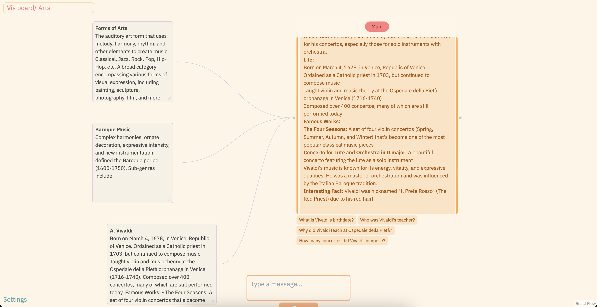

# Vis Board

### Deep dive into anything with Vis Board!

#### Preview:



### Features:

- Distill knowledge from messages
- Text/voice support
- Fully configurable
- Add/delete projects

### How It Works:

- Everything is saved in the user's browser
- Users must provide their OpenAI compatible Api in **Settings** to enable functionality

### Todo:

- Add distill for knowledge box
- Multi-branch support

### Live App

Accessible at [Vis Board](https://vis-board.vercel.app)

### Run

You need Node.js installed. Run the following:

```sh
npm i
npm run dev
```
